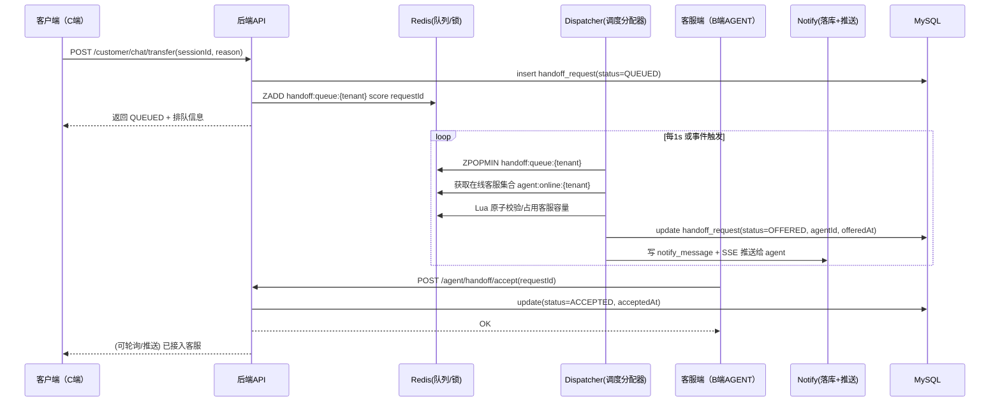

# 转人工（人工客服接入）功能完善方案（基于 YuLu 现有代码）

> 目标：在你现有“AI 对话 + 工单 + 通知中心 + Redis 在线状态”能力上，把 **“转人工”做成闭环**：支持排队、客服在线/忙碌管理、通知推送、全链路记录、转人工原因与审计，并提供可落地的实现步骤与关键代码骨架。  
> 约束：本文**不直接修改你现有代码**；仅给出设计与可复制代码片段/文件骨架、SQL、Redis Key 设计与落地步骤。

---

## 现状盘点（来自你的代码）

- **已有转人工接口（未实现）**：`POST /api/customer/chat/transfer`  
  位置：`src/main/java/com/ityfz/yulu/customer/controller/CustomerChatController.java`（方法内标了 `TODO`，目前只返回成功文案）
- **已有客服在线状态能力（Redis + 心跳）**：
  - 前端：`frontend/src/hooks/useHeartbeat.ts`（AGENT 角色每 30s 调 `agentApi.heartbeat()`）
  - 后端：`/api/admin/auth/heartbeat` + `AgentStatusServiceImpl`（Redis 存在线状态、当前会话数、在线集合 ZSET、TTL）
- **已有通知中心（DB + 查询/已读）**：`notify_message` 表 + `/api/notify/list`、`/api/notify/read`  
  目前前端 `NotifyCenterPage.tsx` 是**拉取/刷新**，不是实时推送。
- **已有工单系统**：`ticket`、`ticket_comment`，并且有 MQ（RabbitMQ）用于派单通知（`TicketEventPublisher` 等）。

> 结论：你已经具备“在线状态 + 通知落库 + 工单体系”。缺的是 **“转人工”主流程/状态机/排队与分配器** 以及 **实时通知**。

---

## 推荐技术栈（尽量复用你已有）

- **后端**：Spring Boot + MyBatis-Plus（延续现状）
- **存储**：MySQL（新增转人工记录表）
- **队列/在线与分布式协调**：Redis（你已经在用，适合做排队/锁/TTL）
- **推送**（二选一，推荐 SSE）：
  - **SSE（Server-Sent Events）**：实现简单、HTTP 友好、无需额外网关配置（推荐）
  - WebSocket：更强，但复杂度略高（鉴权、心跳、断线重连、广播）
- **异步分配**（可选增强）：
  - V1：定时调度（`@Scheduled`） + Redis 原子领取（Lua）
  - V2：RabbitMQ/Redis Stream 驱动分配（更实时，但复杂）

---

## 目标业务闭环（你想要的 5 件事）

### 1) 转人工排队机制
- 客户触发转人工 → 生成一条 **转人工请求**（Handoff Request）  
- 请求进入 Redis 队列（按 tenant 隔离）  
- 分配器选择合适的在线客服 → “派发”该请求给客服

### 2) 客服在线状态管理
复用你现有 `AgentStatusServiceImpl`：
- ONLINE/AWAY/OFFLINE
- current_sessions/max_sessions（并发上限）
补充：
- **忙碌/可接入**的判断统一封装（可以复用 `canAcceptSession()`）
- 登出/关闭页面：可通过 TTL 自然过期，或新增“离线”接口（可选）

### 3) 转人工通知推送
两层通知：
- **可靠通知**：落库到 `notify_message`（你已具备）
- **实时通知**：SSE 推送到在线客服前端（新增）

### 4) 转人工记录表
需要可审计、可回放、可统计（转人工率、平均等待时长、接入时长、超时率等）。

### 5) 转人工原因记录
客户触发原因（按钮/关键词/负面情绪/AI无法回答/客户投诉等）、客服/管理员补充原因、最终结果（接入成功/超时回退/转工单）。

---

## 架构与流程

### 核心时序（简化）



### 状态机（建议）

- `QUEUED`：已排队
- `OFFERED`：已派发给某客服（等待客服接受）
- `ACCEPTED`：客服已接受
- `IN_SERVICE`：进行中（可选：接受后立即进入）
- `COMPLETED`：结束（客户问题已解决）
- `CANCELLED`：客户取消
- `TIMEOUT`：超时（未分配或未接受）
- `FALLBACK_TICKET`：转工单兜底

---

## 数据库设计（新增表）

### 1) 转人工请求表：`chat_handoff_request`

> 用于记录从“申请 → 排队 → 派发 → 接入 → 结束”的全流程。

```sql
CREATE TABLE `chat_handoff_request` (
  `id` BIGINT NOT NULL AUTO_INCREMENT COMMENT '主键',
  `tenant_id` BIGINT NOT NULL COMMENT '租户ID',
  `session_id` BIGINT NOT NULL COMMENT '会话ID（chat_session.id）',
  `customer_user_id` BIGINT NOT NULL COMMENT '客户用户ID',
  `status` VARCHAR(32) NOT NULL COMMENT '状态：QUEUED/OFFERED/ACCEPTED/IN_SERVICE/COMPLETED/CANCELLED/TIMEOUT/FALLBACK_TICKET',

  `reason_code` VARCHAR(64) DEFAULT NULL COMMENT '转人工原因枚举：USER_REQUEST/NEGATIVE_EMOTION/AI_FAIL/COMPLAINT/OTHER',
  `reason_text` VARCHAR(500) DEFAULT NULL COMMENT '原因补充说明（可选）',

  `priority` VARCHAR(16) NOT NULL DEFAULT 'NORMAL' COMMENT '优先级：LOW/NORMAL/HIGH/URGENT',
  `skill_tags` VARCHAR(500) DEFAULT NULL COMMENT '技能标签（可选，逗号分隔，用于分配）',

  `assigned_agent_id` BIGINT DEFAULT NULL COMMENT '被分配客服ID（OFFERED/ACCEPTED后填）',
  `offered_at` DATETIME DEFAULT NULL COMMENT '派发时间',
  `accepted_at` DATETIME DEFAULT NULL COMMENT '接受时间',
  `started_at` DATETIME DEFAULT NULL COMMENT '开始服务时间',
  `ended_at` DATETIME DEFAULT NULL COMMENT '结束时间',

  `timeout_at` DATETIME DEFAULT NULL COMMENT '超时时间点（用于判断是否超时）',
  `fallback_ticket_id` BIGINT DEFAULT NULL COMMENT '兜底工单ID（如转工单）',

  `create_time` DATETIME NOT NULL DEFAULT CURRENT_TIMESTAMP,
  `update_time` DATETIME NOT NULL DEFAULT CURRENT_TIMESTAMP ON UPDATE CURRENT_TIMESTAMP,
  PRIMARY KEY (`id`),
  KEY `idx_tenant_status` (`tenant_id`, `status`),
  KEY `idx_tenant_session` (`tenant_id`, `session_id`),
  KEY `idx_assigned_agent` (`tenant_id`, `assigned_agent_id`),
  KEY `idx_create_time` (`create_time`)
) ENGINE=InnoDB DEFAULT CHARSET=utf8mb4 COLLATE=utf8mb4_unicode_ci COMMENT='转人工请求表';
```

### 2) 转人工事件表（可选）：`chat_handoff_event`

> 用于审计/排查问题，建议保留，成本很低。

```sql
CREATE TABLE `chat_handoff_event` (
  `id` BIGINT NOT NULL AUTO_INCREMENT,
  `tenant_id` BIGINT NOT NULL,
  `request_id` BIGINT NOT NULL COMMENT 'chat_handoff_request.id',
  `event_type` VARCHAR(64) NOT NULL COMMENT '事件类型：CREATED/QUEUED/OFFERED/ACCEPTED/DECLINED/TIMEOUT/CANCELLED/COMPLETED/FALLBACK_TICKET',
  `operator_user_id` BIGINT DEFAULT NULL COMMENT '触发人（客户/客服/系统），系统事件可为空',
  `detail` TEXT DEFAULT NULL COMMENT 'JSON详情（可选）',
  `create_time` DATETIME NOT NULL DEFAULT CURRENT_TIMESTAMP,
  PRIMARY KEY (`id`),
  KEY `idx_req` (`tenant_id`, `request_id`),
  KEY `idx_create_time` (`create_time`)
) ENGINE=InnoDB DEFAULT CHARSET=utf8mb4 COLLATE=utf8mb4_unicode_ci COMMENT='转人工事件表';
```

---

## Redis 设计（排队 + 原子分配）

### Key 命名（按 tenant 隔离）

- **排队队列**（按优先级+时间排序）：  
  `handoff:queue:{tenantId}` = ZSET  
  - member：`requestId`
  - score：`priorityScore*1e13 + createdAtMillis`（优先级越高 score 越小 or 越大都行，统一即可）

- **客服在线集合**（你已有）：  
  `agent:online:{tenantId}` = ZSET（score=heartbeatTimeMillis）

- **客服会话占用**（你已有）：  
  `agent:sessions:{tenantId}:{agentId}` = string/int  
  `agent:status:{tenantId}:{agentId}` = hash（含 max_sessions/current_sessions）

- **派发锁**：  
  `handoff:lock:{tenantId}` = string（短 TTL，防止多实例调度器抢跑）

- **请求派发中间态**（可选）：  
  `handoff:offered:{tenantId}:{requestId}` = string(agentId) TTL=例如60s

### 原子分配（Lua 思路）

目标：从队列弹出一个 requestId 后，选择一个可接入 agent，并原子占用其容量，避免并发重复分配。

Lua 伪代码：

```lua
-- KEYS:
-- 1) agentSessionsKeyPrefix: agent:sessions:{tenantId}:
-- 2) agentStatusKeyPrefix: agent:status:{tenantId}:
-- ARGV:
-- 1) candidateAgentIds (comma separated)
-- return: selectedAgentId or empty
```

实现简化版：Java 侧先筛选候选 agent（ONLINE 且 current<max），再用 `SETNX`/Lua 给 agent 上一个短锁 `handoff:agent_lock:{tenantId}:{agentId}`，拿到锁即选中。

---

## API 设计（建议新增/调整）

### 客户端（C端）

1) **申请转人工**
- `POST /api/customer/chat/transfer`
- 参数（建议改为 JSON Body，便于扩展）：
  - `sessionId`
  - `reasonCode`（可选）
  - `reasonText`（可选）
  - `priority`（可选）
- 返回：
  - `requestId`
  - `status=QUEUED`
  - `queuePosition`（可选）
  - `estimatedWaitSeconds`（可选）

2) **查询转人工状态**
- `GET /api/customer/chat/transfer/{requestId}`
- 返回：
  - 当前 status、assignedAgentId（脱敏）、时间戳等

3) **取消转人工**
- `POST /api/customer/chat/transfer/{requestId}/cancel`

### 客服端（B端 - AGENT）

1) **拉取待接入列表（或我的派发）**
- `GET /api/agent/handoff/inbox?status=OFFERED`

2) **接受**
- `POST /api/agent/handoff/accept`
- body：`requestId`

3) **拒绝**
- `POST /api/agent/handoff/decline`
- body：`requestId`, `reasonText?`

4) **结束服务**
- `POST /api/agent/handoff/complete`
- body：`requestId`, `resultNote?`

### 通知推送（SSE 推荐）

- `GET /api/notify/stream`（SSE）
  - Header：Authorization Bearer
  - 服务端按 `tenantId+userId` 推送事件：
    - `notify:new`
    - `handoff:offered`
    - `handoff:cancelled`

---

## 关键实现思路（后端）

### 1) 转人工服务：`HandoffService`

职责拆分：
- `requestTransfer()`：创建记录 + 入队 + 返回排队信息
- `dispatch()`：从队列拿任务、选择客服、落库为 OFFERED、发通知
- `accept()`：客服接受，落库为 ACCEPTED/IN_SERVICE，绑定关系
- `timeoutSweep()`：扫描超时请求并标记 TIMEOUT/转工单

### 2) 分配策略（先简单，后可扩展）

V1（最小可用）：
- 候选客服 = `AgentStatusService.getOnlineAgents(tenantId)` 里 `canAcceptSession()==true`
- 选择策略：
  - 优先 `current_sessions` 最小（最空闲）
  - 再按 `last_active_time` 最近（避免僵尸在线）

V2（增强）：
- `agent_config.skill_tags` 匹配 `request.skill_tags`
- 工作时间段 `work_schedule` 判断是否在班
- `auto_accept` 支持自动接入

### 3) 兜底策略

建议两级兜底：
- **排队超时**（如 120s）：标记 `TIMEOUT`，并：
  - 回退 AI：提示“当前排队繁忙，已为你继续使用AI服务…”
  - 或创建工单：`ticket` 记录，状态 `PENDING`，priority=HIGH（可配置）
- **派发后未接受超时**（如 60s）：回收该请求，重新入队或换客服再派发。

---

## 关键代码（可直接复制的骨架示例）

> 注意：以下是“示例骨架”，你可按你项目包名/风格调整；不要求一次性全上，建议按“实现步骤”逐步落地。

### 1) Entity：`ChatHandoffRequest`

```java
@Data
@TableName("chat_handoff_request")
public class ChatHandoffRequest {
  @TableId(type = IdType.AUTO)
  private Long id;
  private Long tenantId;
  private Long sessionId;
  private Long customerUserId;
  private String status;

  private String reasonCode;
  private String reasonText;
  private String priority;
  private String skillTags;

  private Long assignedAgentId;
  private LocalDateTime offeredAt;
  private LocalDateTime acceptedAt;
  private LocalDateTime startedAt;
  private LocalDateTime endedAt;
  private LocalDateTime timeoutAt;
  private Long fallbackTicketId;

  @TableField(fill = FieldFill.INSERT)
  private LocalDateTime createTime;
  @TableField(fill = FieldFill.INSERT_UPDATE)
  private LocalDateTime updateTime;
}
```

### 2) DTO：客户申请转人工

```java
@Data
public class TransferRequestCreateDTO {
  @NotNull
  private Long sessionId;
  private String reasonCode;
  private String reasonText;
  private String priority; // LOW/NORMAL/HIGH/URGENT
}
```

### 3) Service 接口：`HandoffService`

```java
public interface HandoffService {
  TransferCreateResponse requestTransfer(Long tenantId, Long userId, TransferRequestCreateDTO dto);
  void dispatchOnce(Long tenantId); // 单次派发（给Scheduled调用）
  void accept(Long tenantId, Long agentId, Long requestId);
  void decline(Long tenantId, Long agentId, Long requestId, String reasonText);
  void cancel(Long tenantId, Long userId, Long requestId);
}
```

### 4) Dispatcher（Scheduled 版本）

```java
@Component
@RequiredArgsConstructor
public class HandoffDispatcherJob {
  private final HandoffService handoffService;
  private final TenantService tenantService; // 或者从DB拉租户列表

  @Scheduled(fixedDelay = 1000)
  public void run() {
    for (Long tenantId : tenantService.listAllTenantIds()) {
      handoffService.dispatchOnce(tenantId);
    }
  }
}
```

### 5) SSE 推送（简化版）

```java
@RestController
@RequestMapping("/api/notify")
public class NotifyStreamController {
  private final Map<String, SseEmitter> emitters = new ConcurrentHashMap<>();

  @GetMapping(value = "/stream", produces = MediaType.TEXT_EVENT_STREAM_VALUE)
  public SseEmitter stream() {
    Long tenantId = SecurityUtil.currentTenantId();
    Long userId = SecurityUtil.currentUserId();
    String key = tenantId + ":" + userId;

    SseEmitter emitter = new SseEmitter(0L);
    emitters.put(key, emitter);
    emitter.onCompletion(() -> emitters.remove(key));
    emitter.onTimeout(() -> emitters.remove(key));
    return emitter;
  }

  public void push(Long tenantId, Long userId, String event, Object data) {
    String key = tenantId + ":" + userId;
    SseEmitter emitter = emitters.get(key);
    if (emitter == null) return;
    try {
      emitter.send(SseEmitter.event().name(event).data(data));
    } catch (Exception e) {
      emitters.remove(key);
    }
  }
}
```

> 说明：SSE 是“在线推送”，不保证一定送达；因此仍然需要你现有的 `notify_message` 落库做可靠兜底。

---

## 前端落地建议（不改你代码，只给实现思路）

### C端（客户聊天页）
- 增加“转人工”按钮：
  - 点击调用 `/customer/chat/transfer`
  - UI 显示：
    - 排队中（队列位置/预计等待）
    - 已派发（等待客服接受）
    - 已接入（进入人工对话模式）
    - 超时回退/已转工单
- 可选择轮询 `/transfer/{requestId}` 或者接 SSE（如果你也想给客户推送）

### B端（客服工作台）
- 增加“人工接入”页/弹窗：
  - 收到 SSE `handoff:offered` 后弹 toast/红点
  - 展示“待接入列表”，支持 Accept/Decline
  - Accept 后把该会话放入“我的会话”（你已有 `AgentSessionsPage` 类似能力，可复用）

---

## 实现步骤（建议 6 个迭代）

### Iteration 1：数据层与最小闭环（1-2 天）
- 新增表：`chat_handoff_request`（必选），`chat_handoff_event`（建议）
- 实现 `HandoffService.requestTransfer()`：落库 + 入 Redis 队列
- 实现 `dispatchOnce()`：从队列取 1 个请求，找 1 个可接入客服，落库为 OFFERED，写 `notify_message`
- 客服端先用“通知中心刷新”看到派发（不做推送）

### Iteration 2：客服接受/拒绝（1 天）
- 新增客服接口：accept/decline
- accept 后把 request 标记 ACCEPTED/IN_SERVICE
- decline 后重新入队或换人派发

### Iteration 3：实时推送（0.5-1 天）
- 增加 SSE `/api/notify/stream`
- 服务端在 OFFERED/ACCEPTED 等节点 push
- 前端接 SSE，提示“有新转人工请求”

### Iteration 4：超时与兜底（1 天）
- 队列超时：TIMEOUT -> 提示客户回退AI 或转工单
- OFFERED 未接受超时：回收并重新派发

### Iteration 5：技能/班次/并发优化（1-2 天）
- `agent_config.skill_tags/work_schedule/max_concurrent_sessions/auto_accept` 生效
- 分配策略升级（标签匹配、最空闲优先、轮询公平）

### Iteration 6：统计与管理面板（1 天）
- 指标：转人工率、平均等待、接入率、超时率、每客服接入量
- 管理员可查看/筛选/导出转人工记录

---

## 验收清单（你可以按这个自测）

- **排队**：客户点击转人工 → request 状态为 QUEUED → Redis 队列有数据
- **分配**：在线且可接入客服存在时 → request 变 OFFERED 且 assigned_agent_id 有值
- **通知**：客服端能收到落库通知（notify_message）+（可选）SSE 即时提示
- **接入**：客服点击接受 → request 变 ACCEPTED/IN_SERVICE
- **并发控制**：客服达到 max_sessions 后，不再被分配
- **超时兜底**：无人在线/无人接受 → request 进入 TIMEOUT 并回退或转工单
- **审计**：event 表能回放关键节点（若启用）

---

## 你下一步需要我补充什么？

为了让这份方案更贴合你现有页面/权限体系，我可以继续补充两块“更具体的代码”：
- **按你现有 `ChatServiceImpl` 的结构**，给出“人工模式下消息如何路由（AI vs AGENT）”的最小改动方案（比如在 Redis 上下文里加 `session:mode=AI/HUMAN`）。
- **前端页面级别的组件设计**：客服接入面板、客户排队状态条、SSE 连接封装与断线重连。


