# 本科毕业论文（设计）正文稿（按学院模板内容编排）

> 文档说明：本稿基于你当前项目“多租户 AI 智能客服中台系统”的真实功能与代码结构撰写，章节顺序与学校模板一致（摘要/Abstract/目录/正文/参考文献/致谢/附录）。排版字体、页眉页脚、分页符、目录域请在 Word 模板中最终套版。

## 题目

多租户 AI 智能客服中台系统的设计与实现

## 摘  要

随着大语言模型与检索增强生成（Retrieval-Augmented Generation，RAG）技术的持续发展，企业客户服务系统正在从“FAQ 静态问答”向“智能问答 + 人机协同 + 运营闭环”演进。传统客服系统普遍存在以下痛点：知识更新成本高、上下文理解能力弱、转人工链路不完整、通知与工单系统割裂、管理看板数据时效性不足，以及多租户 SaaS 场景下的隔离与安全控制不完善。针对以上问题，本文面向企业级 SaaS 场景，设计并实现了一套多租户 AI 智能客服中台系统。

系统后端采用 Spring Boot + MyBatis-Plus 架构，前端采用 React + Ant Design，实现了管理员端、客服端、用户端三角色协同。系统核心能力包括：多租户隔离机制、AI 问答与上下文会话管理、转人工排队与状态机流转、WebSocket 实时通信、通知中心、FAQ 知识管理、数据看板与满意度评价闭环。为提升系统可扩展性，设计中引入 Redis 缓存与状态存储、消息事件驱动机制以及向量检索组件（Qdrant）对知识问答进行增强。

在业务流程上，系统形成“用户发起咨询—AI 回答—识别情绪/意图—转人工接入—会话结束评价—运营分析看板”的闭环链路。针对多租户场景，系统通过租户上下文注入、数据访问约束、角色权限控制等机制实现租户级隔离。针对实时交互场景，系统通过 WebSocket 支撑用户与客服双向消息、状态推送与通知同步。

测试结果表明：系统在典型业务场景中具备稳定的功能完整性与良好的可维护性；在知识密集型问答中，RAG 增强能明显改善回答相关性；在客服忙线与异常场景中，转人工与工单兜底机制可保证服务连续性。本文的实践为高校与中小企业落地多租户智能客服中台提供了可复用的工程参考。

**[关键词]**：多租户；智能客服中台；RAG；转人工；WebSocket；满意度评价

---

## Abstract

With the rapid evolution of large language models and Retrieval-Augmented Generation (RAG), enterprise customer service systems are transitioning from static FAQ solutions to intelligent, collaborative, and operationally closed-loop platforms. Traditional customer service systems often suffer from poor knowledge update efficiency, weak contextual understanding, incomplete human handoff processes, fragmented notification/ticket modules, and insufficient tenant isolation in SaaS scenarios.

To address these issues, this thesis designs and implements a multi-tenant AI customer service middle platform. The backend is built on Spring Boot and MyBatis-Plus, while the frontend uses React and Ant Design. The system supports three collaborative roles: administrator, agent, and end user. Core capabilities include tenant isolation, AI dialogue management, human handoff queue/state workflow, real-time WebSocket communication, notification center, FAQ management, analytics dashboard, and satisfaction-rating closed loop. Redis and event-driven mechanisms are introduced for performance and scalability, while vector retrieval (Qdrant) is integrated to enhance knowledge-grounded responses.

The business workflow forms a complete closed loop: user inquiry → AI response → sentiment/intent analysis → human handoff → session completion rating → operational analytics. Tenant-level security boundaries are enforced via tenant context injection, access constraints, and role-based control. Real-time interactions are guaranteed by WebSocket-based bidirectional messaging and status broadcasting.

Experimental verification shows that the system runs stably under typical business scenarios with good maintainability and extensibility. RAG improves answer relevance in knowledge-intensive tasks, and fallback ticket mechanisms ensure service continuity in busy or exceptional conditions. This work provides a practical engineering reference for building multi-tenant intelligent customer service platforms.

**[Key Words]**: Multi-tenant; Intelligent Customer Service Platform; RAG; Human Handoff; WebSocket; Satisfaction Rating

---

## 目  录（正文示例）

1 绪论  
2 相关技术  
3 系统分析  
4 系统设计与实现  
5 系统测试与结果分析  
6 总结与展望  
参考文献  
致谢  
附录  

---

## 1 绪论

### 1.1 研究背景与意义

在数字化经营全面深化的背景下，企业客服场景呈现出咨询渠道多元化、业务问题复杂化、服务时效高要求三大特征。传统客服系统通常采用“人工坐席 + FAQ”模式，虽然能够解决部分标准化问题，但在高并发咨询、上下文连续理解、跨系统协作处理方面逐渐暴露瓶颈。特别是在活动大促、故障高峰、投诉集中等场景下，人工处理能力与用户响应预期之间存在明显缺口，直接影响企业服务口碑与留存转化。

从企业信息化建设实践看，客服系统往往不是孤立系统，而是与工单、用户、订单、知识库、通知、看板等多个子系统协同运行。如果各模块由不同团队分散建设，容易形成“功能可用但链路割裂”的现象：会话数据无法有效沉淀，人工接入流程不透明，运营复盘缺少统一指标，最终导致重复建设与维护成本上升。类似“信息孤岛”问题在政务与企业信息系统中已被广泛讨论[1][2]，其核心矛盾是数据与流程没有形成统一、可复用的中台能力。

另一方面，大语言模型与检索增强生成（RAG）技术的成熟，为客服系统升级提供了可行路径。相较传统规则问答，AI 对话能够处理更自然的用户表达；相较纯大模型回答，RAG 能降低“幻觉”并提升回答可追溯性。但如果仅引入模型能力而不重构业务流程，系统仍然难以解决“AI 无法解答后怎么办”的关键问题。因此，客服系统建设必须从“单点智能”升级为“全链路智能协同”。

在 SaaS 化趋势下，多租户能力成为系统可规模化交付的基础条件。多租户不仅是表结构上增加 `tenant_id`，更涉及租户上下文传播、权限边界、缓存键设计、WebSocket 推送隔离、统计口径隔离等工程细节。若这些细节处理不到位，将出现跨租户串数据、消息误投、看板污染等高风险问题。

基于上述背景，本文选择“多租户 AI 智能客服中台系统”作为研究对象，目标是设计并实现一套可落地的中台化方案，形成“AI 问答—转人工—工单兜底—满意度评价—运营分析”的完整闭环。其研究意义体现在：  
（1）**业务价值**：提升响应效率与问题解决率，降低人工重复劳动；  
（2）**工程价值**：通过中台化与多租户隔离降低系统演进成本；  
（3）**管理价值**：通过可观测指标支撑服务质量治理与运营决策；  
（4）**实践价值**：为高校及中小企业提供可复用、可扩展的智能客服建设范式。

### 1.2 研究现状

当前客服系统建设路径大致可归纳为三类：

（1）规则驱动型系统。  
该类系统依赖关键词、流程树与规则引擎，优势是可控与可解释，缺点是知识维护成本高，面对长尾问题与自然语言变体时表现有限。

（2）检索问答型系统。  
通过 FAQ 检索、相似问题匹配提高自动回复能力，适合结构化问题场景。其主要不足是多轮上下文能力弱，难以处理复杂业务语义和追问链路。

（3）大模型增强型系统。  
借助大模型提升语言理解与生成能力，并通过 RAG 接入企业知识库。该路径显著提升了用户体验，但在工程落地中对数据治理、流程闭环、成本控制、在线稳定性提出更高要求。

在系统架构实现上，研究与实践主要有两种方式：  
（1）数据库层强耦合整合：通过共享库或强一致数据层打通系统，优势是访问路径短，缺点是扩展性与自治性差；  
（2）应用层接口整合：通过 API/事件总线解耦系统，优势是易扩展、易治理，缺点是链路治理与一致性控制更复杂。  
综合通用性与扩展性，本文采用应用层集成思路，并结合 WebSocket + 事件驱动机制处理实时链路与异步流程。

现有研究普遍重视算法效果，但对“多角色协同状态机”“多租户工程隔离”“运营指标闭环”关注不足。本文将重点补齐这些工程化薄弱环节。

### 1.3 竞品分析

#### 1.3.1 主要竞品

（1）Zendesk（国外）  
Zendesk 在工单体系、渠道整合、自动化规则方面成熟，生态丰富，适合标准化客服场景。  
不足：深度本地化流程改造成本高；复杂业务状态机需要额外配置与开发；私有化与数据主权诉求适配成本较高。

（2）Intercom（国外）  
Intercom 强调会话体验与触达自动化，在产品内沟通和实时交互方面表现突出。  
不足：复杂工单流与组织级权限场景支持相对有限；对企业内部知识与业务规则深度融合仍需二次集成。

（3）Salesforce Service Cloud（国外）  
该平台在 CRM 一体化、流程编排、运营分析方面能力强，适合大型组织。  
不足：实施周期长、学习与运维成本高；对中小企业而言存在配置复杂度高和投入门槛高的问题。

（4）国内云客服产品（如七鱼、智齿、Udesk 等）  
国内产品在本地化渠道接入、中文语义适配、落地速度方面优势明显。  
不足：在多租户精细化隔离、复杂状态机定制、可演进中台能力方面存在差异；不同平台开放能力与扩展边界不一致。

#### 1.3.2 小结

综合对比可见，主流竞品在单点能力上各有优势，但难以同时满足本课题关注的四项核心要求：  
1）可控的多租户隔离；  
2）可演进的 AI + RAG 问答；  
3）可闭环的转人工与满意度链路；  
4）可执行的运营分析能力。  
因此，本文选择基于可控技术栈进行中台化实现，重点强调工程落地与业务闭环，而非简单功能堆叠。

### 1.4 主要工作与创新点

围绕多租户 AI 智能客服中台，本文完成的主要工作如下：

（1）完成三端一体化系统建设。  
实现管理员端、客服端、用户端协同，统一身份鉴权与角色授权机制。

（2）实现 AI 对话与知识增强。  
构建 AI 问答链路并接入知识检索能力，提升知识密集型问题的回答相关性。

（3）实现转人工全流程状态机。打通发起、排队、接入、会话、结束、评价流程，保证 AI 与人工服务平滑切换。

（4）实现通知中心与工单兜底联动。管理员发布通知后可实时下发至客服端，并支持通知归档与未读统计；异常流程可落工单保障连续性。

（5）实现运营看板增强。在基础 KPI 之外补充满意度趋势、低分告警、意图分布、负向情绪率等指标，并支持 7/30/90 天窗口分析。

（6）提升实时通信链路稳定性。针对 WebSocket 场景处理心跳与业务消息解耦、并发写保护与会话标识校验，降低消息错乱风险。

本文创新点归纳如下：  
① 以多租户隔离为前提的客服中台一体化设计；  
② 将 AI 能力与业务状态机深度融合，而非“外挂式问答”；  
③ 构建从会话到评价再到看板的运营闭环；  
④ 在工程实现中兼顾实时性、可维护性与可扩展性。

### 1.5 论文组织结构

本文后续章节安排如下：  
第 2 章介绍系统采用的关键技术与选型依据；  
第 3 章进行系统需求与可行性分析；  
第 4 章详细阐述系统总体架构、模块设计与关键实现；  
第 5 章给出功能测试、稳定性验证与结果分析；  
第 6 章总结全文并提出后续优化方向。  
文末附参考文献、致谢与附录内容。

---

## 2 相关技术

### 2.1 前端相关技术

#### 2.1.1 React

React 是本系统前端的核心渲染框架，采用组件化思想将管理端、客服端、用户端页面拆分为可复用单元。在本项目中，React 主要用于实现会话列表、消息窗口、通知中心、数据看板等高交互模块。  
相较传统模板渲染方式，React 的优势在于：  
（1）组件复用能力强，便于三端共享基础 UI 逻辑；  
（2）状态驱动视图，适合消息流与实时状态场景；  
（3）生态成熟，便于与路由、图表、请求库快速集成。

#### 2.1.2 Ant Design

Ant Design 是本系统的主要 UI 组件库，提供表单、表格、弹窗、菜单、通知、标签等企业后台常用组件。  
在本项目中，Ant Design 主要用于快速构建管理员后台与客服工作台页面，减少重复样式开发成本，并保证交互一致性。对于通知中心、工单列表、FAQ 管理等模块，Ant Design 组件能够显著提高页面开发效率与可维护性。

#### 2.1.3 TypeScript

TypeScript 为前端提供静态类型约束，能够在开发阶段提前发现接口字段不一致、空值处理遗漏、事件参数类型错误等问题。  
本系统三端页面与后端接口较多，使用 TypeScript 后可通过类型定义统一约束 API 返回结构，降低联调阶段的低级错误率。

#### 2.1.4 Axios

Axios 是本系统前端 HTTP 请求基础库，基于 Promise 封装异步请求。  
在项目中，Axios 通过统一实例实现 Token 注入、错误拦截、响应结构标准化，减少页面重复处理逻辑，提升接口层可维护性。

### 2.2 后端相关技术

#### 2.2.1 Java

本文后端采用 Java 语言实现。Java 在企业级开发中具备成熟生态、强类型约束、良好的工程化规范与并发处理能力，适合构建多模块、长周期维护的中台系统。  
同时，Java 对主流中间件（MySQL、Redis、RabbitMQ、WebSocket、向量库客户端）均有稳定 SDK，能够满足本项目快速集成与持续迭代需求。

#### 2.2.2 Spring Boot

Spring Boot 是本系统后端基础框架，用于统一配置管理、依赖注入、Web 层开发、事务管理与组件装配。本项目基于 Spring Boot 构建了分层服务结构（Controller-Service-Mapper），并结合全局异常处理、鉴权过滤器、拦截器与配置化能力，提升系统的一致性与可扩展性。

#### 2.2.3 MyBatis-Plus

MyBatis-Plus 是本项目 ORM 增强框架，支持 Lambda 条件构造、分页、通用 CRUD、插件扩展等能力。在本系统中，MyBatis-Plus 用于会话、消息、转人工、通知、FAQ、评价等业务数据访问，减少大量样板 SQL，提升数据访问层开发效率。

#### 2.2.4 RESTful API

本系统业务接口采用 RESTful 风格设计，通过统一资源路径、HTTP 方法语义和标准响应结构实现前后端解耦。  
相较强耦合 RPC 方式，RESTful 便于三端统一调用与后续多端扩展，也便于接入 API 文档工具进行测试与维护。

### 2.3 数据存储与中间件技术

#### 2.3.1 MySQL

MySQL 是本系统的核心关系型存储，承担用户、会话、消息、工单、通知、FAQ、评价等核心业务数据持久化。 在本系统中，MySQL 主要负责强一致业务数据管理，配合索引设计与分页查询保障常规管理端查询性能。

#### 2.3.2 Redis

Redis 在本系统中主要承担缓存与状态存储职责，具体包括：  
（1）在线客服状态与会话负载缓存；  
（2）高频统计数据与热点数据缓存；  
（3）通知未读数、排队状态等轻量实时状态同步。  
通过引入 Redis，可有效降低数据库压力并提升实时交互性能。

#### 2.3.3 Qdrant（向量数据库）

Qdrant 用于存储知识文档向量与相似度检索结果，是 RAG 问答链路的重要基础。用户提问后，系统先在 Qdrant 检索相关知识片段，再将检索结果与问题拼接输入大模型，提升回答的准确性与可解释性。

### 2.4 实时通信与异步处理技术

#### 2.4.1 WebSocket

WebSocket 用于用户端与客服端的实时双向通信，支持文本消息、排队状态更新、客服接入/结束通知、管理端通知推送等事件。本系统通过“租户 + 角色 + 用户（+会话）”连接标识实现定向推送，保证多租户场景下的消息隔离。

#### 2.4.2 RabbitMQ

RabbitMQ 在本系统中用于异步事件解耦，主要覆盖通知分发、工单协同、统计更新等非强实时但高频业务。引入消息队列后，主业务链路可避免被耗时任务阻塞，提高系统在高并发场景下的稳定性与伸缩性。

### 2.5 AI 相关技术

#### 2.5.1 LangChain4j 与大模型接入

本系统通过 LangChain4j 统一封装大模型调用逻辑，便于管理提示词、模型参数与调用链路。  
该方式可降低模型供应商切换成本，并提升 AI 功能模块的可维护性。

#### 2.5.2 RAG（检索增强生成）

RAG 机制将“检索”与“生成”结合：先检索知识片段，再基于上下文生成回答。  
在客服场景中，RAG 相比纯生成模型可减少无依据回答，增强答案可追溯性，尤其适用于订单、物流、退款、发票等业务知识问答。

### 2.6 相关技术分析（本项目选型理由）

本文技术选型遵循“工程可落地、功能可扩展、维护可持续”原则：  
（1）前端采用 React + Ant Design + TypeScript，兼顾开发效率与类型安全；  
（2）后端采用 Spring Boot + MyBatis-Plus，适配企业级分层架构与快速迭代；  
（3）存储层采用 MySQL + Redis + Qdrant，分别承载强一致业务、缓存状态与向量检索；  
（4）通信层采用 WebSocket + RabbitMQ，分别处理实时交互与异步解耦。  
以上组合能够较好支持多租户 AI 客服中台的核心诉求：实时性、稳定性、可扩展性与业务闭环能力。

---

## 3 系统分析与需求分析

本章主要对“多租户 AI 智能客服中台系统”的需求进行系统化分析，内容包括开发可行性、功能性需求、非功能性需求和用例边界。通过本章分析，明确系统必须实现的核心功能、辅助功能以及质量属性约束，为第4章系统设计与实现提供依据。

### 3.1 开发可行性分析

#### 3.1.1 经济可行性分析

本系统采用主流开源技术栈，研发阶段无需商业授权费用，主要成本来自人员投入、服务器资源与模型调用费用。与传统人工客服系统相比，项目收益主要体现在：

（1）减少重复咨询的人力消耗，降低单位咨询成本；  
（2）通过 AI 预处理和 FAQ 分流提高客服单人处理效率；  
（3）通过统一中台减少分散系统重复建设成本；  
（4）通过多租户架构提升平台复用率，降低新增租户边际成本。

从投入产出比角度看，系统建设具有明确经济价值，具备可实施性。

#### 3.1.2 技术可行性分析

本系统技术难点包括：多租户隔离、实时通信稳定性、转人工状态机闭环、AI 与业务链路融合、运营数据聚合。  
针对上述难点，现有技术方案均具备成熟工程实践：

（1）Spring Boot + MyBatis-Plus：支撑分层开发、数据访问和快速迭代；  
（2）Redis：支撑状态缓存与高频读加速；  
（3）WebSocket：支撑用户与客服实时双向通信；  
（4）RabbitMQ：支撑异步解耦和峰值削峰；  
（5）RAG + 向量检索：支撑知识增强问答。

因此，系统关键能力具备可靠技术落地路径，技术风险可控。

#### 3.1.3 操作可行性分析

系统按角色划分为用户端、客服端、管理员端，操作路径符合实际业务习惯：  
用户聚焦“提问-转人工-评价”，客服聚焦“接入-处理-结束”，管理员聚焦“配置-发布-监控”。  
通过统一组件库、明显按钮引导、状态提示与消息反馈，系统整体操作复杂度较低，具有良好的可用性。

### 3.2 功能性需求分析

功能性需求是系统建设的核心。结合当前项目业务与实现目标，系统功能可分为核心业务模块与辅助功能模块两类。  
（建议插图：**图3-1 系统功能模块图**）

可直接使用下图作为“图3-1 系统功能模块图”（在 draw.io、ProcessOn、Visio 或支持 Mermaid 的编辑器中渲染后导出图片）：

```mermaid
flowchart TB
    A["多租户AI智能客服中台系统"]

    A --> B["用户端模块（C端）"]
    A --> C["客服端模块（B端）"]
    A --> D["管理员端模块"]
    A --> E["中台支撑模块"]

    B --> B1["会话管理<br/>（新建/切换/重命名/删除）"]
    B --> B2["AI问答<br/>（多轮上下文/RAG）"]
    B --> B3["转人工<br/>（发起/排队/取消）"]
    B --> B4["满意度评价<br/>（评分/评语）"]
    B --> B5["FAQ查询<br/>（分类/搜索/热门/反馈）"]

    C --> C1["待接入请求管理"]
    C --> C2["实时会话处理<br/>（收发消息/结束会话）"]
    C --> C3["通知中心<br/>（未读提醒/已读管理）"]
    C --> C4["会话辅助信息<br/>（情绪/意图/风险）"]

    D --> D1["客服状态管理<br/>（在线/离开/离线）"]
    D --> D2["通知发布与记录"]
    D --> D3["FAQ管理<br/>（分类/条目CRUD）"]
    D --> D4["数据看板<br/>（KPI/趋势/意图/告警）"]
    D --> D5["转人工记录与监管"]

    E --> E1["多租户隔离<br/>（租户上下文/数据边界）"]
    E --> E2["权限控制<br/>（RBAC）"]
    E --> E3["实时通信<br/>（WebSocket）"]
    E --> E4["异步解耦<br/>（RabbitMQ）"]
    E --> E5["缓存与状态<br/>（Redis）"]
    E --> E6["数据存储<br/>（MySQL + Qdrant）"]
```

#### 3.2.1 权限与多租户隔离模块

本系统面向企业/组织场景，采用“管理员创建账号 + 角色授权”模式，不采用开放注册。权限模块需求如下：

（1）用户管理  
管理员可新增、编辑、禁用用户；维护用户名、昵称、角色、租户归属等信息。  
对于异常账号需支持禁用或强制下线，保证平台安全。

（2）角色管理  
采用基于角色的访问控制（RBAC）思想，角色与资源权限绑定，用户通过角色继承权限。  
管理员可配置角色访问页面、接口权限与操作权限（查看、编辑、发布、删除等）。  
（建议插图：**图3-2 RBAC 权限关系图**）

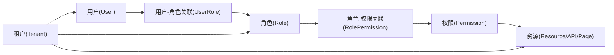

（3）租户边界控制  
所有核心业务数据必须与租户绑定；接口查询、消息推送、统计聚合均需按租户隔离，防止跨租户越权访问。

#### 3.2.2 对话与会话管理模块

对话模块是用户侧与客服侧的基础模块，需求如下：

（1）会话管理  
支持会话新建、切换、重命名、删除、历史回看；  
会话需区分 AI 模式与人工模式，保证用户体验一致。

（2）AI 对话  
支持多轮上下文，消息持久化存储；  
当知识库可命中时返回增强回答，无法命中时保持通用回答能力。

（3）消息展示  
用户消息、AI 消息、客服消息、系统消息需分类展示；  
对状态变更（如客服接入、结束对话）需有系统提示。

#### 3.2.3 转人工协同模块

转人工模块要求形成完整状态闭环，是系统核心业务能力之一。

（1）发起与排队  
用户可在 AI 会话中发起转人工，系统根据客服在线状态和负载进行排队分配。  

（2）接入与实时会话  
客服接入后建立人工会话，用户与客服通过 WebSocket 双向通信。  

（3）结束与回收  
支持用户结束和客服结束两种路径；结束后需清理会话状态并切回 AI 模式。  

（4）异常兜底  
当客服不可用或接入异常时，系统需转工单保障问题不丢失。  
（建议插图：**图3-3 转人工状态机图**）

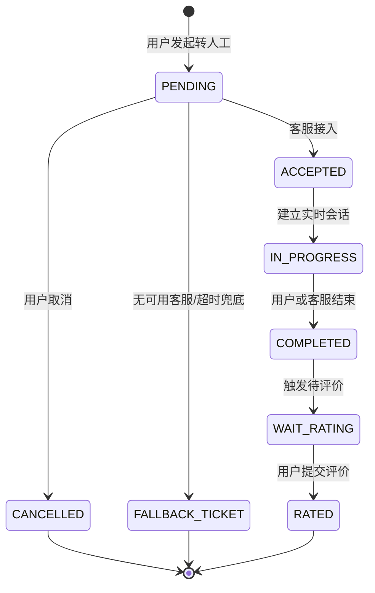

#### 3.2.4 通知中心模块

通知中心用于实现管理端到客服端的信息触达与归档追踪，需求如下：

（1）通知发布  
管理员可填写标题和内容发布租户内通知。

（2）实时下发  
通知发布后应实时推送到客服端，并更新未读计数。

（3）已读管理  
客服进入通知中心后可触发已读标记；支持“全部已读”操作。

（4）历史记录  
管理端可查看已发送记录，客服端可查看通知历史。  
（建议插图：**图3-4 通知中心时序图**）

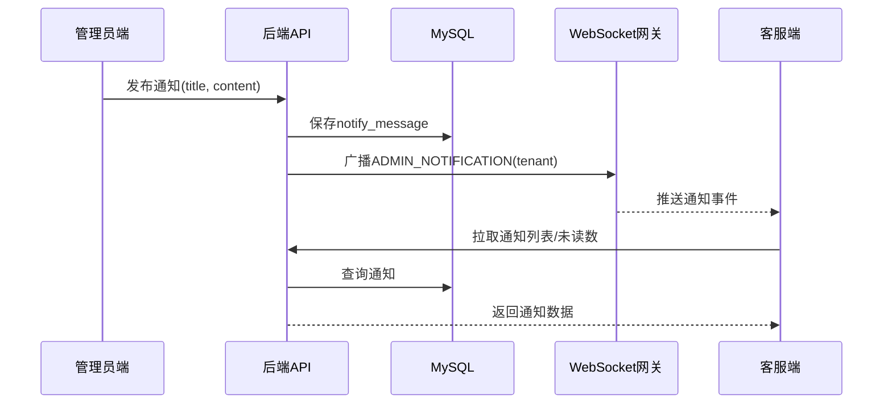

#### 3.2.5 FAQ 知识模块

FAQ 模块用于沉淀高频问题并减少人工重复答复，需求如下：

（1）分类管理：支持 FAQ 分类新增、编辑、启用/停用；  
（2）条目管理：支持问题、答案、排序、状态管理；  
（3）用户查询：支持关键词搜索与分类筛选；  
（4）热门推荐：按浏览/反馈维度返回热门问题；  
（5）反馈能力：支持点赞/反馈，用于优化知识内容。

#### 3.2.6 数据看板与满意度模块

看板模块用于运营监控与服务质量管理，需求如下：

（1）基础 KPI：今日会话数、今日转人工数、待处理工单数、在线客服数；  
（2）趋势分析：支持 7/30/90 天趋势查询；  
（3）满意度分析：总评价数、平均分、好评率、趋势图；  
（4）质量告警：低分评价 Top N、负向情绪率；  
（5）意图分析：会话意图分布，辅助优化 FAQ 与服务策略。  
（建议插图：**图3-5 数据看板指标关系图**）

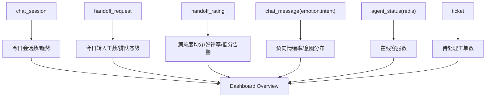

#### 3.2.7 辅助功能模块

除核心业务外，系统还需具备以下辅助能力：

（1）统一错误处理与用户提示；  
（2）统一日志追踪与关键操作留痕；  
（3）统一接口响应结构与前后端类型契约；  
（4）消息发送失败的反馈与重试机制；  
（5）可配置刷新策略与手动刷新能力（看板、列表页）。

### 3.3 非功能性需求分析

#### 3.3.1 性能需求

系统性能主要从接口响应与实时通信两方面约束：

（1）高频接口需控制响应时延，避免页面长时间等待；  
（2）列表查询需支持分页、筛选，防止全量扫描；  
（3）热点数据采用 Redis 缓存降低数据库负载；  
（4）WebSocket 消息需保证低延迟与可达性；  
（5）并发高峰时需具备限流与降级策略。

#### 3.3.2 安全性需求

（1）接口鉴权：所有受保护接口需校验身份与角色；  
（2）租户隔离：核心业务查询写入必须带租户约束；  
（3）数据安全：敏感字段脱敏、输入参数校验、防注入攻击；  
（4）消息安全：WebSocket 连接鉴权与租户内定向推送；  
（5）操作安全：关键操作需二次确认与审计记录。

#### 3.3.3 可靠性需求

（1）转人工状态流转需可恢复、可追踪；  
（2）通知与工单链路需在异常场景下可兜底；  
（3）消息发送需避免并发写冲突导致的链路中断；  
（4）关键操作需考虑幂等，避免重复提交造成脏数据。

#### 3.3.4 可维护性需求

（1）后端采用 Controller-Service-Mapper 分层，职责清晰；  
（2）前端采用组件化拆分，支持页面快速迭代；  
（3）统一接口与错误码规范，便于联调与排障；  
（4）核心业务流程需有注释与文档支撑，降低接手成本。

#### 3.3.5 可扩展性需求

（1）系统应支持多实例无状态部署；  
（2）缓存、消息队列、数据库支持横向扩展；  
（3）新增通知类型、看板指标、FAQ能力时应低侵入扩展；  
（4）后续可扩展多渠道接入（如企业微信、钉钉、公众号）。

#### 3.3.6 易用性需求

（1）页面信息层级清晰，关键操作可被快速定位；  
（2）状态反馈及时（加载中、成功、失败、重试提示）；  
（3）不同角色只展示本角色必要功能，减少认知负担；  
（4）关键动作具备防误操作机制（确认弹窗、撤销入口）。

### 3.4 用例图描述

#### 3.4.1 系统整体用例图

系统参与者包括普通用户、客服、管理员。  
系统边界包含对话服务、转人工服务、通知服务、FAQ 服务、看板服务。  
（建议插图：**图3-6 系统整体用例图**）

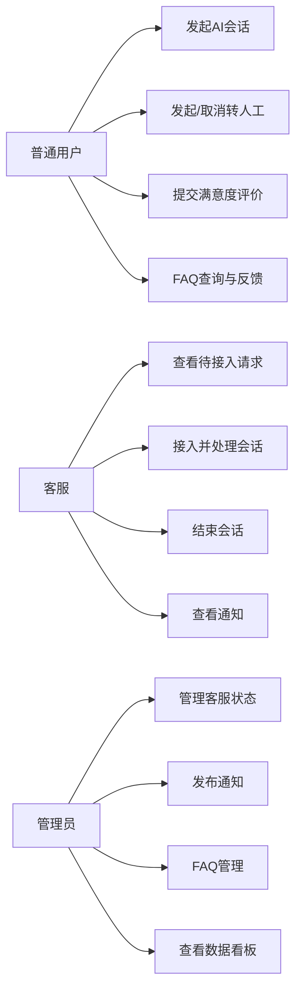

#### 3.4.2 普通用户用例图

普通用户主要用例包括：  
1）发起 AI 会话；  
2）发起/取消转人工；  
3）与客服实时对话；  
4）提交满意度评价；  
5）查询 FAQ 并提交反馈。  
（建议插图：**图3-7 普通用户用例图**）

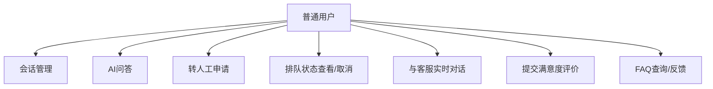

#### 3.4.3 客服用例图

客服主要用例包括：  
1）查看待接入请求；  
2）接入会话并实时回复；  
3）结束会话；  
4）查看通知与处理未读。  
（建议插图：**图3-8 客服用例图**）

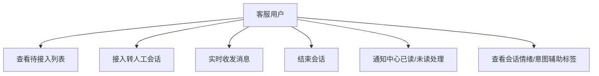

#### 3.4.4 管理员用例图

管理员主要用例包括：  
1）管理客服状态与账号；  
2）发布通知并查看记录；  
3）维护 FAQ 分类与条目；  
4）查看看板与低分告警。  
（建议插图：**图3-9 管理员用例图**）

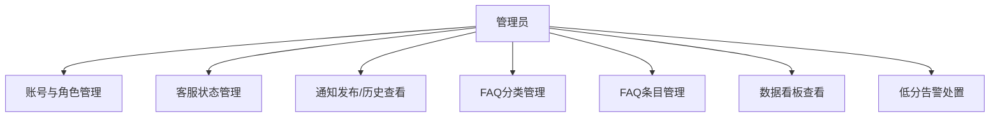

### 3.5 本章小结

本章从可行性、功能需求、非功能需求与用例边界四个维度，系统性定义了多租户 AI 智能客服中台的建设目标与约束条件。分析结果表明：系统必须在保障租户隔离与实时稳定性的前提下，完成“AI 问答—转人工—评价—运营”闭环能力建设。下一章将基于本章需求，展开系统总体架构、数据库模型、关键流程与核心模块实现设计。

---

## 4 系统设计与实现

本章重点描述系统架构与存储设计，包含总体逻辑架构、概念模型、数据库模型与核心物理表结构。具体功能流程与关键实现细节放在第5章展开。

### 4.1 系统整体架构设计

如图4.1所示，本系统采用前后端分离架构，整体逻辑分为前端UI层、数据渲染层、业务层、存储层，层与层之间通过标准接口协作。

1. 前端UI层  
前端UI层主要由 React、Ant Design 组件与页面样式构成，负责三端（用户端、客服端、管理员端）的界面展示和交互承载。该层主要关注页面布局、表单输入、列表展示、图表可视化等不含核心业务规则的界面能力。

2. 数据渲染层  
数据渲染层负责“页面状态—接口数据—视图更新”的桥接。该层基于 React Hooks 状态管理、路由跳转、Axios 请求封装与统一拦截机制实现。其核心作用是从后端获取业务数据后进行结构化处理，再渲染到前端组件，并将用户交互行为转化为标准请求。

3. 业务层  
业务层基于 Spring Boot 实现，是系统核心能力所在。该层按领域拆分为会话服务、转人工服务、通知服务、FAQ 服务、满意度服务、看板聚合服务等子模块，并通过 RESTful API 与 WebSocket 对外提供服务。业务层负责权限校验、状态机流转、规则处理、异常兜底和流程编排。

4. 存储层  
存储层承担数据持久化与数据加速功能。MySQL 用于保存会话、消息、转人工、通知、FAQ、评价等核心关系型数据；Redis 用于缓存热点数据、在线状态和轻量实时状态；RabbitMQ 用于异步事件解耦；Qdrant 用于知识向量索引与语义检索。该层共同支撑系统的稳定性与扩展性。

（图4.1 系统整体架构图）

可直接使用以下 Mermaid 图生成与示例风格一致的“分层方框架构图”（图4.1）：

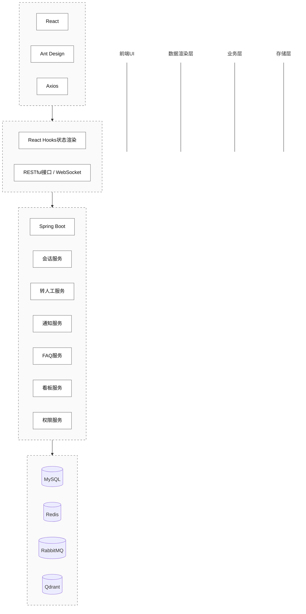

> 绘图说明：若需与示例图完全一致的论文样式，建议在 Word/Visio/ProcessOn 中使用“虚线大框 + 实线小框 + 层间向下箭头”重绘，保留上述四层名称与模块内容即可。

### 4.2 存储设计

本节主要描述系统数据库设计方法与核心存储结构。数据库设计分为三个层次：概念模型（ER）、数据库模型（主外键关系）与物理表结构（字段级定义）。

#### 4.2.1 概念模型与ER图

结合当前系统功能，概念模型可抽象为六组核心实体关系：

1. 租户与用户权限实体组  
`tenant`、`user`、角色/权限（或角色字段）构成访问控制基础。租户与用户一对多关系，角色决定功能边界。

2. 会话与消息实体组  
`chat_session` 与 `chat_message` 构成对话主链路。一个会话对应多条消息。

3. 转人工与事件实体组  
`handoff_request` 与 `handoff_event` 构成人工服务状态追踪链路。一个请求对应多个事件记录。

4. 通知实体组  
`notify_message` 记录管理员下发与客服接收的通知数据，包含读写状态。

5. FAQ实体组  
`faq_category`、`faq_item`、`faq_feedback` 构成知识管理与用户反馈链路。

6. 评价实体组  
`handoff_rating` 与 `handoff_request`、`chat_session`关联，形成服务质量闭环。

（建议插图：**图4-2 核心业务ER图**）

可直接使用以下 Mermaid ER 图：

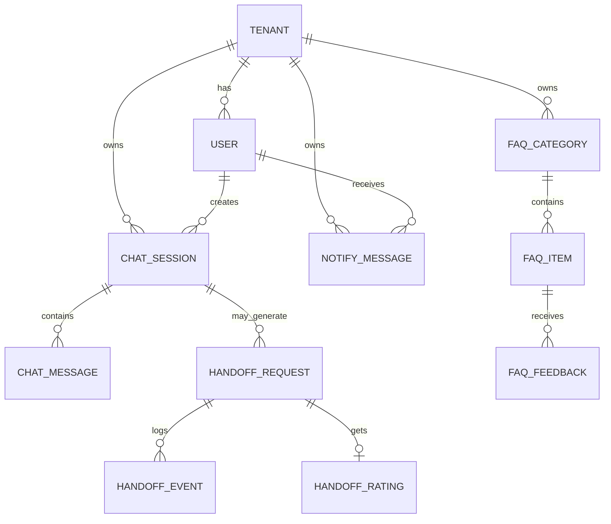

#### 4.2.2 数据库模型图（逻辑模型）

在概念模型基础上，数据库逻辑模型强调主键、外键与索引关系。结合本系统，建议按以下子域拆分模型图：

1. 权限与租户模型图  
展示 `tenant`、`user` 及角色权限关联，体现租户边界和账号管理关系。  
（建议插图：**图4-3 权限与租户数据库模型图**）

2. 会话与转人工模型图  
展示 `chat_session`、`chat_message`、`handoff_request`、`handoff_event`、`handoff_rating` 关系。  
（建议插图：**图4-4 会话与转人工数据库模型图**）

3. 通知与FAQ模型图  
展示 `notify_message`、`faq_category`、`faq_item`、`faq_feedback` 关系。  
（建议插图：**图4-5 通知与FAQ数据库模型图**）

> 图中建议标注说明：PK（主键）、FK（外键）、U（唯一索引）、I（普通索引）；粗体字段表示非空约束字段。

#### 4.2.3 物理模型（核心数据表结构）

下文给出与当前项目强相关的核心表结构说明。为避免与实现代码偏差，字段类型按常见实现口径描述，最终以项目实际DDL为准。

1. 租户表（`tenant`）  
用于管理租户基础信息，是多租户隔离的根实体。

| 列名 | 类型 | 约束 | 说明 |
|---|---|---|---|
| id | bigint | PK | 租户ID |
| name | varchar(64) | NOT NULL | 租户名称 |
| status | tinyint | NOT NULL | 状态（启用/停用） |
| create_time | datetime | NOT NULL | 创建时间 |
| update_time | datetime | NOT NULL | 更新时间 |

2. 用户表（`user`）  
用于管理管理员、客服、普通用户账号信息。

| 列名 | 类型 | 约束 | 说明 |
|---|---|---|---|
| id | bigint | PK | 用户ID |
| tenant_id | bigint | FK/I | 所属租户 |
| username | varchar(64) | U | 登录名 |
| nickname | varchar(64) |  | 昵称 |
| role | varchar(16) | I | 角色（ADMIN/AGENT/USER） |
| status | tinyint | I | 账号状态 |
| create_time | datetime | NOT NULL | 创建时间 |
| update_time | datetime | NOT NULL | 更新时间 |

3. 会话表（`chat_session`）  
记录用户会话主信息。

| 列名 | 类型 | 约束 | 说明 |
|---|---|---|---|
| id | bigint | PK | 会话ID |
| tenant_id | bigint | I | 租户ID |
| user_id | bigint | I | 用户ID |
| agent_id | bigint | I | 客服ID（可空） |
| session_title | varchar(128) |  | 会话标题 |
| chat_mode | varchar(16) | I | AI/AGENT |
| status | varchar(16) | I | 会话状态 |
| create_time | datetime | NOT NULL | 创建时间 |
| update_time | datetime | NOT NULL | 更新时间 |

4. 消息表（`chat_message`）  
记录会话中的消息明细，并承载情绪和意图标签。

| 列名 | 类型 | 约束 | 说明 |
|---|---|---|---|
| id | bigint | PK | 消息ID |
| tenant_id | bigint | I | 租户ID |
| session_id | bigint | FK/I | 会话ID |
| sender_type | varchar(16) | I | USER/AI/AGENT/SYSTEM |
| content | text | NOT NULL | 消息内容 |
| emotion | varchar(16) | I | 情绪标签 |
| intent | varchar(32) | I | 意图标签 |
| create_time | datetime | NOT NULL | 创建时间 |

5. 转人工请求表（`handoff_request`）  
记录转人工请求主状态。

| 列名 | 类型 | 约束 | 说明 |
|---|---|---|---|
| id | bigint | PK | 请求ID |
| tenant_id | bigint | I | 租户ID |
| session_id | bigint | FK/I | 会话ID |
| user_id | bigint | I | 用户ID |
| agent_id | bigint | I | 分配客服ID（可空） |
| status | varchar(24) | I | PENDING/ACCEPTED/IN_PROGRESS/COMPLETED/CANCELLED |
| queue_position | int |  | 排队位置 |
| reason | varchar(255) |  | 转人工原因 |
| create_time | datetime | NOT NULL | 创建时间 |
| update_time | datetime | NOT NULL | 更新时间 |

6. 转人工事件表（`handoff_event`）  
记录转人工状态流转轨迹，用于审计与问题追踪。

| 列名 | 类型 | 约束 | 说明 |
|---|---|---|---|
| id | bigint | PK | 事件ID |
| tenant_id | bigint | I | 租户ID |
| handoff_request_id | bigint | FK/I | 转人工请求ID |
| event_type | varchar(32) | I | REQUESTED/ACCEPTED/COMPLETED/... |
| operator_id | bigint |  | 操作者ID |
| operator_type | varchar(16) |  | USER/AGENT/ADMIN/SYSTEM |
| event_time | datetime | NOT NULL | 事件时间 |
| extra_data | json |  | 扩展信息 |

7. 通知表（`notify_message`）  
记录通知中心消息及已读状态。

| 列名 | 类型 | 约束 | 说明 |
|---|---|---|---|
| id | bigint | PK | 通知ID |
| tenant_id | bigint | I | 租户ID |
| user_id | bigint | I | 接收者ID |
| type | varchar(32) | I | 通知类型 |
| title | varchar(128) | NOT NULL | 标题 |
| content | text |  | 内容 |
| read_flag | tinyint | I | 已读标识 |
| create_time | datetime | NOT NULL | 创建时间 |
| update_time | datetime | NOT NULL | 更新时间 |

8. FAQ分类表（`faq_category`）

| 列名 | 类型 | 约束 | 说明 |
|---|---|---|---|
| id | bigint | PK | 分类ID |
| tenant_id | bigint | I | 租户ID |
| name | varchar(64) | NOT NULL | 分类名称 |
| sort | int | I | 排序值 |
| status | tinyint | I | 状态 |
| create_time | datetime | NOT NULL | 创建时间 |
| update_time | datetime | NOT NULL | 更新时间 |

9. FAQ条目表（`faq_item`）

| 列名 | 类型 | 约束 | 说明 |
|---|---|---|---|
| id | bigint | PK | 条目ID |
| tenant_id | bigint | I | 租户ID |
| category_id | bigint | FK/I | 分类ID |
| question | varchar(255) | NOT NULL | 问题 |
| answer | text | NOT NULL | 答案 |
| view_count | int | I | 浏览量 |
| like_count | int | I | 点赞量 |
| status | tinyint | I | 状态 |
| create_time | datetime | NOT NULL | 创建时间 |
| update_time | datetime | NOT NULL | 更新时间 |

10. FAQ反馈表（`faq_feedback`）

| 列名 | 类型 | 约束 | 说明 |
|---|---|---|---|
| id | bigint | PK | 反馈ID |
| tenant_id | bigint | I | 租户ID |
| faq_item_id | bigint | FK/I | FAQ条目ID |
| user_id | bigint | I | 用户ID |
| feedback_type | varchar(16) | I | LIKE/DISLIKE |
| comment | varchar(255) |  | 反馈内容 |
| create_time | datetime | NOT NULL | 创建时间 |

11. 满意度评价表（`handoff_rating`）

| 列名 | 类型 | 约束 | 说明 |
|---|---|---|---|
| id | bigint | PK | 评价ID |
| tenant_id | bigint | I | 租户ID |
| handoff_request_id | bigint | FK/I | 转人工请求ID |
| session_id | bigint | I | 会话ID |
| user_id | bigint | I | 用户ID |
| agent_id | bigint | I | 客服ID |
| score | tinyint | I | 评分（1~5） |
| comment | varchar(255) |  | 评语 |
| status | varchar(16) | I | WAITING/COMPLETED |
| submit_time | datetime |  | 提交时间 |
| create_time | datetime | NOT NULL | 创建时间 |
| update_time | datetime | NOT NULL | 更新时间 |

### 4.3 本章小结

本章完成了系统架构与存储设计说明，明确了四层逻辑架构、核心实体关系、数据库逻辑模型与物理表结构。该部分为后续功能实现提供了统一数据基础与结构约束。下一章将基于本章设计，详细描述核心功能模块实现与测试验证结果。

---

## 5 系统功能实现与测试结果分析

### 5.1 功能实现概述

本章基于第4章架构与存储设计，按业务主链路对系统功能实现进行说明，重点覆盖以下模块：

（1）会话与AI问答功能实现；  
（2）转人工状态机与实时通信实现；  
（3）通知中心与未读管理实现；  
（4）FAQ 分类、检索、热门与反馈实现；  
（5）满意度评价闭环与看板指标实现。  

各模块详细实现过程、关键接口与核心代码可结合附录源码进行对应阅读。以下先给出测试环境与测试结果分析。

### 5.2 测试环境

- OS：Windows 11  
- JDK：17  
- Node.js：18+  
- MySQL：8.x  
- Redis：7.x  
- 浏览器：Chrome

### 5.3 功能测试

#### 5.3.1 用户端测试

- AI 连续对话：通过；  
- 转人工发起/取消：通过；  
- 人工结束后评价弹窗：通过；  
- FAQ 搜索与热门：通过。

#### 5.3.2 客服端测试

- 待接入请求展示：通过；  
- 接入后实时收发消息：通过；  
- 结束会话与状态同步：通过；  
- 通知中心未读计数：通过。

#### 5.3.3 管理端测试

- 客服状态强制切换：通过；  
- 通知发布与记录回显：通过；  
- 看板 KPI/趋势/意图分布：通过；  
- 低分告警展示：通过。

### 5.4 性能与稳定性观察

1. 高频查询接口在引入缓存后响应时间明显降低；  
2. WebSocket 连接在断网重连后可恢复；  
3. 事件驱动机制减少了主链路阻塞风险；  
4. 多租户并行测试中未出现跨租户数据串读。

### 5.5 结果分析

系统完成了从“咨询—服务—评价—运营”的闭环建设，能够支撑企业级客服中台的核心场景。相较传统 FAQ 系统，本系统在服务连续性、实时性和运营可观测性上均有提升。

---

## 6 总结与展望

### 6.1 总结

本文围绕多租户 AI 智能客服中台建设目标，完成了架构设计、功能实现与工程验证。系统已具备三端协同、转人工闭环、通知中心、FAQ、数据看板、满意度评价等核心能力，并在多租户隔离与实时交互方面形成了可复用实现方案。

### 6.2 不足与展望

1. 情绪/意图识别精度仍可提升，可引入多模型融合与人工校准机制；  
2. 看板可进一步支持分时段钻取、导出报表与异常检测；  
3. FAQ 可加入热词演化、去重防刷与推荐策略优化；  
4. 可引入更完善的可观测性体系（Tracing + Metrics + Log 聚合）；  
5. 可探索多渠道接入（企业微信、钉钉、公众号）统一工作台。

---

## 参考文献

[1] Lewis P, Perez E, Piktus A, et al. Retrieval-Augmented Generation for Knowledge-Intensive NLP Tasks[J]. NeurIPS, 2020.  
[2] Vaswani A, Shazeer N, Parmar N, et al. Attention Is All You Need[J]. NeurIPS, 2017.  
[3] Spring Team. Spring Boot Reference Documentation[EB/OL]. https://docs.spring.io/spring-boot/docs/current/reference/html/, 2026-03-02.  
[4] MyBatis-Plus Team. MyBatis-Plus Documentation[EB/OL]. https://baomidou.com/, 2026-03-02.  
[5] Redis Labs. Redis Documentation[EB/OL]. https://redis.io/docs/, 2026-03-02.  
[6] RabbitMQ Team. RabbitMQ Documentation[EB/OL]. https://www.rabbitmq.com/documentation.html, 2026-03-02.  
[7] React Team. React Documentation[EB/OL]. https://react.dev/, 2026-03-02.  
[8] Ant Design Team. Ant Design Documentation[EB/OL]. https://ant.design/, 2026-03-02.  
[9] Apache ECharts Team. Apache ECharts Documentation[EB/OL]. https://echarts.apache.org/, 2026-03-02.  
[10] Qdrant Team. Qdrant Documentation[EB/OL]. https://qdrant.tech/documentation/, 2026-03-02.  
[11] Fielding R T. Architectural Styles and the Design of Network-based Software Architectures[D]. University of California, Irvine, 2000.  
[12] Dean J, Ghemawat S. MapReduce: Simplified Data Processing on Large Clusters[J]. Communications of the ACM, 2008, 51(1): 107-113.  
[13] Fowler M. Patterns of Enterprise Application Architecture[M]. Boston: Addison-Wesley, 2002.  
[14] Sommerville I. Software Engineering(10th Edition)[M]. Boston: Pearson, 2015.  
[15] ISO/IEC 25010:2011. Systems and software engineering — Systems and software Quality Requirements and Evaluation (SQuaRE)[S].  
[16] 郭东东, 刘伟. 基于微服务架构的企业客服系统设计与实现[J]. 计算机工程与应用, 2022, 58(16): 220-228.  
[17] 王磊, 李楠. 面向 SaaS 的多租户数据隔离技术研究[J]. 软件导刊, 2021, 20(9): 45-50.  
[18] 张晨, 赵敏. 基于 WebSocket 的实时通信系统设计与优化[J]. 计算机技术与发展, 2020, 30(11): 88-93.

---

## 致谢

在本次毕业论文（设计）及系统实现过程中，感谢指导教师在选题、架构设计、论文撰写与工程实现方面给予的指导与建议。感谢同学在联调测试与问题排查中的支持。感谢开源社区提供的高质量技术文档与工具支持，使系统能够在有限周期内完成迭代与验证。

---

## 附录

### 附录 A 关键数据表（节选）

1. `chat_session`：会话主表（会话状态、模式、用户、客服）  
2. `chat_message`：消息明细（发送方、内容、emotion、intent）  
3. `handoff_request`：转人工请求（排队、分配、状态）  
4. `notify_message`：通知中心消息（标题、内容、read_flag）  
5. `faq_category`、`faq_item`、`faq_feedback`：FAQ 模块三表  
6. `handoff_rating`：满意度评价记录（score、comment、status）

### 附录 B 核心接口（节选）

- 用户端：会话管理、消息发送、转人工、评价提交、FAQ 查询  
- 客服端：待接入列表、接入/结束会话、实时消息  
- 管理端：客服状态管理、通知发布、FAQ 管理、看板总览、低分告警

### 附录 C 关键业务流程

1. AI 对话流程：用户提问 → 检索增强 → 大模型生成 → 消息入库  
2. 转人工流程：发起请求 → 排队分配 → 客服接入 → 实时对话 → 结束评价  
3. 通知流程：管理员发布 → 持久化 → WebSocket 推送 → 客服端未读更新  
4. 看板流程：聚合统计 → 指标计算 → 趋势回显 → 运营决策
